# UAOS Architecture

This document describes the actual run-time architecture of the Ultimate Amiga OS kernel as implemented.

---

## System Architecture Diagram

```mermaid
flowchart TD
    %% ── Boot path ────────────────────────────────────────────────────────────
    subgraph BOOT["Boot (GRUB2 / UEFI)"]
        direction LR
        GRUB["GRUB2 Multiboot2\n(hybrid BIOS + EFI ISO)"]
        ENTRY["uaos_kernel_entry.asm\n32-bit protected → 64-bit long mode"]
        GRUB --> ENTRY
    end

    %% ── Userspace ────────────────────────────────────────────────────────────
    subgraph USER["User Space  (Ring 3)"]
        direction LR
        X64BIN["Native x86-64 ELF64 binaries\nhello · pwd · file · strings\nfind · Guide\n(libuaos / INT 0x80 ABI)"]
        M68KBIN["Amiga Hunk binaries\n(M68k machine code\nCopperBars · AGATest · …)"]
    end

    %% ── Kernel ───────────────────────────────────────────────────────────────
    subgraph KERNEL["Kernel Space  (Ring 0)"]

        subgraph EXEC["exec/  —  Task & ABI layer"]
            TASK["Task scheduler\n(co-operative, Ring-3 TSS)"]
            SYSCALL["INT 0x80 syscall dispatch\n(syscall_dispatch.c)"]
            ELF64["x86-64 ELF64 loader\n(elf64_loader.c)"]
            MMU["MMU sandbox\n4-level paging · 2 MB huge pages\n(mmu_sandbox.c)"]
            PF["#PF page-fault ISR\nChip-window trap & decode\n(page_fault_handler.c)"]
            THUNK["Thunk handler\nILLEGAL-opcode → native C stub\n(thunk_handler.c)"]
            ROM["ROM module registry\n(rom_modules.c)"]
        end

        subgraph AMIGALIBS["AmigaOS-compatible libraries  (kernel/exec/)"]
            direction LR
            EXECLIB["exec.library v45\nAlloc · Tasks · Signals · IPC"]
            DOSLIB["dos.library v40\n→ VFS"]
            GRAPHLIB["graphics.library v40"]
            INTLIB["intuition.library v40"]
            WBLIB["workbench.library v45"]
            BSDLIB["bsdsocket.library v4\n→ TCP/IP stack"]
            OTHERLIBS["utility · console · mathffp\nlocale · ixemul · timer\nkeyboard  (devices/libs)"]
        end

        subgraph EMU["emulation/  —  M68k subsystem"]
            MUSASHI["Musashi M68k interpreter\n(src/musashi/)"]
            GLUE["M68k glue layer\nHunk loader · LVO stubs · DOS stubs\n(uaos_m68k_glue.c)"]
            UAEBRIDGE["UAE bridge\nRAM-base management\n(uaos_uae_bridge.c)"]
            GUESTRAM["Guest RAM\n8 MB chip + 8 MB fast\n(flat 16 MB window)"]
        end

        subgraph CHIPSET["kernel/chipset/  —  AGA/ECS chip emulator"]
            CHIPEMU["chip_emu.c\nAgnus DMA · Copper · Blitter\nSprites · HAM8 · EHB\nCIA-A/B timers · Contention"]
            FLOPPY["floppy.c\nMFM · ADF images\nPaula disk DMA"]
            PAULAAUDIO["Paula audio\n4-channel DMA mixer"]
        end

        subgraph DISPLAY["kernel/display/  —  Workbench GUI"]
            FB["Framebuffer\n(linear, from Multiboot2 tag)"]
            WM["Window manager\nclick-focus · drag · resize · z-order"]
            DESKTOP["Desktop\nWorkbench backdrop · icons · menu bar"]
            SHELLWIN["Shell window\nscrollable · command history"]
            OTHERWIN["calc · clock · pointer · vim\nnetinfo · about · filebrowser"]
        end

        subgraph DOS["kernel/dos/  —  Filesystem & storage"]
            VFS["VFS layer\n(vfs.c)"]
            RAMFS["RAM filesystem\n1024 nodes · 512 KB/file"]
            FAT32["FAT32 driver"]
            PFS3["PFS3 driver"]
            EXT4["EXT4 driver (read-only)"]
            ISO["ISO 9660 driver"]
            BLOCKDEV["Block device layer\nMBR partition table\n(blockdev.c)"]
        end

        subgraph NET["kernel/net/  —  TCP/IP stack"]
            NETSTACK["IPv4 · ARP · ICMP\nTCP · UDP · DHCP\nDNS · NTP"]
        end

        subgraph AUDIO["kernel/audio/  —  Audio"]
            AC97["AC97 driver\n(48 kHz stereo)"]
            PCSPEAKER["PC speaker driver"]
            AUDIOMIX["Audio mixer\nring-buffer · Paula → AC97"]
        end

        subgraph IRQ["kernel/irq/  —  IRQ / interrupt layer"]
            IDT["IDT (256 vectors)\n8259A PIC remap IRQ→32-47"]
            APIC["Local APIC"]
            PS2M["PS/2 mouse driver (IRQ12)"]
            PS2K["PS/2 keyboard driver (IRQ1)"]
            RTC["RTC driver (IRQ8)\nCMOS · UIE interrupt"]
        end

        subgraph SHELL["kernel/shell/  —  Native C: commands"]
            CMDS["65+ built-in commands\ndir · mem · net · ps · vim …\n(cmd_*.c)"]
        end

    end

    %% ── PC Hardware ──────────────────────────────────────────────────────────
    subgraph HW["PC Hardware"]
        direction LR
        VGAHW["VGA / VESA\nlinear framebuffer"]
        AC97HW["AC97 audio\ncodec"]
        PS2HW["PS/2 controller\nmouse + keyboard"]
        RTCHW["CMOS RTC"]
        IDEHW["IDE / ATAPI\n(HDD · CD-ROM)"]
        VIRTIOHW["VirtIO block\n(QEMU virtual disk)"]
        NICHW["NIC\nIntel e1000\nVirtIO-Net"]
        PICHW["8259A PIC\n+ Local APIC"]
    end

    %% ══════════════════════════════════════════════════════════════════════════
    %% Edges — Boot → Kernel
    %% ══════════════════════════════════════════════════════════════════════════
    ENTRY --> EXEC
    ENTRY --> IRQ
    ENTRY --> DISPLAY
    ENTRY --> DOS
    ENTRY --> NET
    ENTRY --> AUDIO
    ENTRY --> CHIPSET

    %% ── x86-64 userspace path ────────────────────────────────────────────────
    X64BIN -->|"INT 0x80\nsyscall"| SYSCALL
    SYSCALL --> TASK
    SYSCALL --> DOS
    SYSCALL --> DISPLAY
    ELF64 -->|"loads into Ring-3"| X64BIN

    %% ── M68k execution path ──────────────────────────────────────────────────
    M68KBIN -->|"Hunk loader"| GLUE
    GLUE --> MUSASHI
    MUSASHI -->|"memory r/w callbacks"| GUESTRAM
    MUSASHI -->|"ILLEGAL opcode"| THUNK
    THUNK -->|"dispatch"| AMIGALIBS
    GLUE --> UAEBRIDGE

    %% ── Chip register trap path (the key mechanism) ──────────────────────────
    MUSASHI -->|"accesses 0xB00000–0xDFFFFF\n(page not-present)"| MMU
    MMU -->|"#PF exception\n(CIA/chip window)"| PF
    PF -->|"chip_emu_read/write"| CHIPEMU

    %% ── Chipset internals ────────────────────────────────────────────────────
    CHIPEMU --> FLOPPY
    CHIPEMU --> PAULAAUDIO
    PAULAAUDIO --> AUDIOMIX

    %% ── ROM / AmigaOS libraries ──────────────────────────────────────────────
    ROM --> EXECLIB
    ROM --> DOSLIB
    ROM --> GRAPHLIB
    ROM --> INTLIB
    ROM --> WBLIB
    ROM --> BSDLIB
    ROM --> OTHERLIBS
    DOSLIB --> VFS
    BSDLIB --> NETSTACK

    %% ── Display / GUI ────────────────────────────────────────────────────────
    WM --> FB
    DESKTOP --> WM
    SHELLWIN --> WM
    OTHERWIN --> WM
    CMDS --> SHELLWIN
    GRAPHLIB --> FB
    CHIPEMU -->|"rendered frame\n→ framebuffer"| FB

    %% ── Storage stack ────────────────────────────────────────────────────────
    VFS --> RAMFS
    VFS --> FAT32
    VFS --> PFS3
    VFS --> EXT4
    VFS --> ISO
    FAT32 --> BLOCKDEV
    PFS3  --> BLOCKDEV
    EXT4  --> BLOCKDEV
    ISO   --> BLOCKDEV

    %% ── Network ──────────────────────────────────────────────────────────────
    NETSTACK --> NICHW

    %% ── Audio ────────────────────────────────────────────────────────────────
    AUDIOMIX --> AC97
    AUDIOMIX --> PCSPEAKER
    AC97 --> AC97HW
    PCSPEAKER --> AC97HW

    %% ── IRQ layer → hardware ─────────────────────────────────────────────────
    IDT --> PICHW
    APIC --> PICHW
    PS2M --> PS2HW
    PS2K --> PS2HW
    RTC --> RTCHW

    %% ── Block device → hardware ──────────────────────────────────────────────
    BLOCKDEV --> IDEHW
    BLOCKDEV --> VIRTIOHW

    %% ── Framebuffer → display hardware ──────────────────────────────────────
    FB --> VGAHW
```

---

## Key Mechanisms Explained

### 1. Boot Path

GRUB2 Multiboot2 loads the kernel ELF, passes a framebuffer info tag, then jumps to the 32-bit NASM entry stub which transitions the CPU to 64-bit long mode before calling `uaos_kernel_main()`.

### 2. Native x86-64 Userspace (Ring 3)

Programs in `system/userspace/` are compiled as position-independent ELF64 binaries, wrapped with a 32-byte `UAOS` header, and loaded by the kernel ELF64 loader. They run in Ring 3 and communicate with the kernel exclusively via `INT 0x80` with a Linux-compatible register convention (`RAX` = syscall number, `RDI/RSI/RDX` = args). 18 syscalls are currently defined covering file I/O, directory access, memory allocation, process spawn/wait, and GUI window management.

### 3. M68k Execution Path

Amiga Hunk binaries are loaded by the M68k glue layer (`uaos_m68k_glue.c`), which maps code/data/BSS segments into a flat 16 MB guest RAM buffer (8 MB chip + 8 MB fast). The Musashi interpreted M68k core executes instructions from this buffer. When Musashi encounters an `ILLEGAL` opcode followed by the `0x414D` signature word and a function index, the thunk handler intercepts the trap and dispatches to the appropriate native C stub in the AmigaOS library implementations.

### 4. Chip Register Trap — the MMU Page-Fault Mechanism

This is the architectural centrepiece. The MMU sandbox maps the Amiga chip/CIA hardware register window (`0x00B00000–0x00DFFFFF`) as **not present** in the x86 page tables. Any access to this range — whether from Musashi's memory callbacks or direct M68k-generated addresses — triggers an x86 `#PF` exception (vector 14). The page fault ISR (`page_fault_handler.c`) decodes the faulting instruction's ModRM byte to identify whether it is a read or write and which register is involved, then forwards the operation to `chip_emu_read()` or `chip_emu_write()`. For reads, it injects the result back into the saved register state and advances `RIP` past the faulting instruction before returning from interrupt.

### 5. AGA/ECS Chip Emulator

`chip_emu.c` implements the Amiga custom chips:

| Subsystem | Features |
|---|---|
| **Agnus / DMA** | Cycle-accurate DMA slot arbitration, interlace field tracking, chip RAM contention |
| **Copper** | Copper list execution, `WAIT`/`MOVE` instructions, per-scanline palette |
| **Blitter** | Line mode, area fill, MSB-first fill, descending mode, busy flag |
| **Sprites** | 8 hardware sprites, sub-pixel positioning, priority ordering, border clipping, superhires scaling |
| **Display** | HAM8, 64-colour EHB, `DIWHIGH` extended display window, planar → linear blit |
| **Paula audio** | 4-channel DMA sampler, 48 kHz stereo mixer → AC97 / PC speaker backends |
| **Floppy** | MFM encoding, ADF image support, Paula disk DMA, write-protect control |
| **CIA-A/B** | Timers, keyboard SDR buffer, parallel port |

### 6. AmigaOS Libraries (in-kernel C implementations)

Rather than loading a Kickstart ROM, UAOS re-implements the AmigaOS public API as native C stubs registered in the ROM module registry. All libraries live in `kernel/exec/` and are called either via the thunk handler (from M68k code) or directly (from native kernel code).

### 7. VFS / Storage Stack

The VFS layer provides a unified namespace. `RAM:` is always mounted at boot. Additional volumes are auto-detected from block devices (VirtIO, IDE/ATAPI) and mounted by FAT32 volume label or PFS3/EXT4/ISO9660 detection.

### 8. Display / Window Manager

The Workbench-style GUI is rendered entirely into the linear framebuffer supplied by GRUB2. The window manager handles Z-order, focus, drag, and resize for multiple simultaneous windows. The M68k chip emulator outputs rendered frames into the same framebuffer when running AGA demos.
